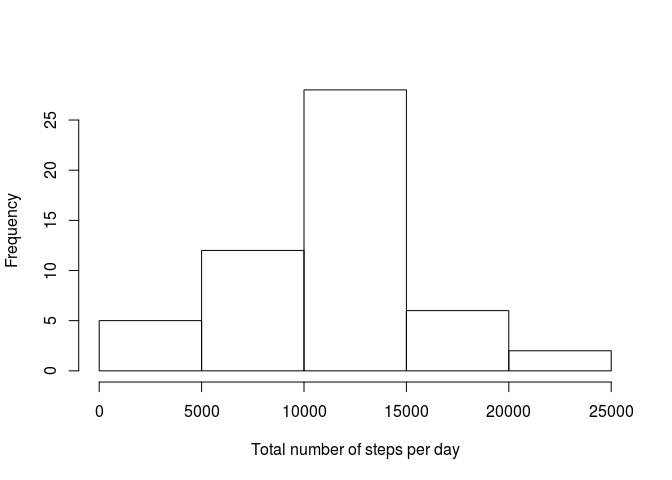

# Reproducible Research: Peer Assessment 1
Vincent Guillemot  
19/07/2015  


We begin this report by loading the required libraries. The result of a `sessionInfo()`, giving the version of R, the packages used for the analysis, the OS, etc. is given at the end of this report.


```r
require(knitr) # for its function kable
```

```
## Loading required package: knitr
```

```r
require(ggplot2) # plots
```

```
## Loading required package: ggplot2
```

```
## Warning in library(package, lib.loc = lib.loc, character.only = TRUE,
## logical.return = TRUE, : there is no package called 'ggplot2'
```

## Loading and preprocessing the data

We begin by unzipping the compressed folder with `unz` and reading `activity.csv` with the function `read.csv`. This first version of the raw dataset is called `x`.


```r
x <- read.csv(unz("activity.zip", "activity.csv")) 
```

Let us take a first look at `x`:

 * it is a `data.frame`,
 * it has 17568 rows,
 * and 3 columns,
 * and 2304 rows contain `NA` values.

The names of the variables (columns) are given by the following command.


```r
names(x)
```

```
## [1] "steps"    "date"     "interval"
```

Finally, we would like to know how many days of data are missing and if there are days with missing and non-missing data. To explore the pattern of missing data in `x`, we create a little function, called `na.ratio`, that will give for a given day the number of missing cells divided by the total number of measurement for this day. We present the result of this function in the following table.


```r
na.ratio <- function(row) 
  sum(is.na(row))/length(row)

res <- t(table(aggregate(x$steps, list(x$date), na.ratio)$x))
kable(res)
```


  0    1
---  ---
 53    8

There are 8 whole days of missing data.


## What is mean total number of steps taken per day?

To compute the mean number of steps taken per day, we have first to compute, for each day, the total number of steps. This is achieved thanks to the function `aggregate`. We visualize the results with a histogram.


```r
tot.step <- aggregate(x$steps, list(x$date), sum)
hist(tot.step$x, xlab="Total number of steps per day", main="")
```

 

The mean of the total number of steps is given by the following command, which contains an argument `na.rm=TRUE` to remove the missing data.


```r
(mean.steps <- mean(tot.step$x, na.rm=TRUE))
```

```
## [1] 10766.19
```


## What is the average daily activity pattern?


## Imputing missing values


## Are there differences in activity patterns between weekdays and weekends?


## Session Info


```r
print(sessionInfo(),locale=F)
```

```
## R version 3.2.0 (2015-04-16)
## Platform: i686-pc-linux-gnu (32-bit)
## Running under: Ubuntu 14.04.2 LTS
## 
## attached base packages:
## [1] stats     graphics  grDevices utils     datasets  methods   base     
## 
## other attached packages:
## [1] knitr_1.10.5
## 
## loaded via a namespace (and not attached):
##  [1] magrittr_1.5    formatR_1.2     tools_3.2.0     htmltools_0.2.6
##  [5] yaml_2.1.13     stringi_0.5-5   rmarkdown_0.7   highr_0.5      
##  [9] stringr_1.0.0   digest_0.6.8    evaluate_0.7
```

