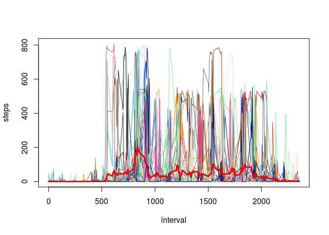
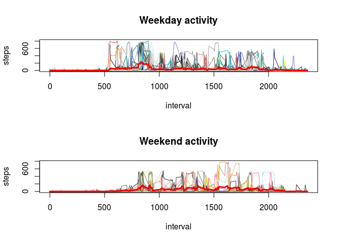

# Reproducible Research: Peer Assessment 1
Vincent Guillemot  
19/07/2015  


We begin this report by loading the required libraries. The result of a `sessionInfo()`, giving the version of R, the packages used for the analysis, the OS, etc. is given at the end of this report.


```r
require(knitr) # for its function kable
```

```
## Loading required package: knitr
```

## Loading and preprocessing the data

We begin by unzipping the compressed folder with `unz` and reading `activity.csv` with the function `read.csv`. This first version of the raw dataset is called `x`.


```r
x <- read.csv(unz("activity.zip", "activity.csv")) 
```

Let us take a first look at `x`:

 * it is a `data.frame`,
 * it has 17568 rows,
 * and 3 columns,
 * and 2304 rows contain `NA` values.

The names of the variables (columns) are given by the following command.


```r
names(x)
```

```
## [1] "steps"    "date"     "interval"
```

Finally, we would like to know how many days of data are missing and if there are days with missing and non-missing data. To explore the pattern of missing data in `x`, we create a little function, called `na.ratio`, that will give for a given day the number of missing cells divided by the total number of measurement for this day. We present the result of this function in the following table.


```r
na.ratio <- function(row) 
  sum(is.na(row))/length(row)

res <- t(table(aggregate(x$steps, list(x$date), na.ratio)$x))
kable(res)
```


  0    1
---  ---
 53    8

There are 8 whole days of missing data.


## What is mean total number of steps taken per day?

To compute the mean number of steps taken per day, we have first to compute, for each day, the total number of steps. This is achieved thanks to the function `aggregate`. We visualize the results with a histogram.


```r
tot.step <- aggregate(x$steps, list(x$date), sum)
hist(tot.step$x, xlab="Total number of steps per day", main="")
```

 

The mean of the total number of steps is given by the following command, which contains an argument `na.rm=TRUE` to remove the missing data.


```r
(mean.steps <- mean(tot.step$x, na.rm=TRUE))
```

```
## [1] 10766.19
```

## What is the average daily activity pattern?

In the following chunk of code, we both compute and propose a graphical representation of the average daily activity. For each "interval", we compute the average daily activity at this time point by taking the mean of all activities at said point.


```r
# An empty frame
plot(steps ~ interval, data=x, pch=16, type="n")
# Activities per day
for (day in unique(x$date)) 
  lines(steps ~ interval, data=subset(x,date==day), 
       pch=16, col=sample(colors(),1))

# The mean activity in bright red
mean.activity <- aggregate(x$steps,list(x$interval),mean,na.rm=TRUE)
lines(mean.activity, col="red2", lwd=3)
```

 


## Imputing missing values

Since whole days are missing, we simply replace the missing activity by the mean activity previously computed.


```r
x$steps[is.na(x$steps)] <- mean.activity$x
```

## Are there differences in activity patterns between weekdays and weekends?

Finally, we use the function `weekdays` [^1] to create a factor variable with two levels : `weekday` and `weekend`.

[^1]: set in French for the moment


```r
x$DATE <- as.Date(x$date)
x$WEEKDAY <- weekdays(x$DATE)
x$WD <- factor(ifelse(weekdays(x$DATE) %in% c("samedi","dimanche"), 
               "weekend", "weekday"))

x.weekday <- subset(x, WD=="weekday")
x.weekend <- subset(x, WD=="weekend")
```

We can visualize the difference between the two patterns of activity on the following plots.


```r
layout(1:2)

### Weekdays
plot(steps ~ interval, data=x.weekday, pch=16, type="n",
     main="Weekday activity")
# Activities per day
for (day in unique(x.weekday$date)) 
  lines(steps ~ interval, data=subset(x.weekday,date==day), 
       pch=16, col=sample(colors(),1))
mean.activity.weekday <- aggregate(x.weekday$steps,
                                   list(x.weekday$interval),
                                   mean,na.rm=TRUE)
lines(mean.activity.weekday, col="red2", lwd=3)

### Weekends
plot(steps ~ interval, data=x.weekend, pch=16, type="n",
     main="Weekend activity")
# Activities per day
for (day in unique(x.weekend$date)) 
  lines(steps ~ interval, data=subset(x.weekend,date==day), 
       pch=16, col=sample(colors(),1))

# The mean activity in bright red
mean.activity.weekend <- aggregate(x.weekend$steps,
                           list(x.weekend$interval),
                           mean,na.rm=TRUE)
lines(mean.activity.weekend, col="red2", lwd=3)
```

 


We can therefore test if the person on which the measurements were made had a different activity during the weekend than during the rest of the week.


```r
tot.step.weekday <- aggregate(x.weekday$steps, list(x.weekday$date), sum)$x
tot.step.weekend <- aggregate(x.weekend$steps, list(x.weekend$date), sum)$x
t.test(tot.step.weekday, tot.step.weekend)
```

```
## 
## 	Welch Two Sample t-test
## 
## data:  tot.step.weekday and tot.step.weekend
## t = -2.3349, df = 53.738, p-value = 0.02331
## alternative hypothesis: true difference in means is not equal to 0
## 95 percent confidence interval:
##  -3616.5192  -274.8332
## sample estimates:
## mean of x mean of y 
##  10255.85  12201.52
```

The conclusion is that the person whose activity was measured is more active during the weekend.

## Session Info


```r
print(sessionInfo(),locale=F)
```

```
## R version 3.2.1 (2015-06-18)
## Platform: i686-pc-linux-gnu (32-bit)
## Running under: Ubuntu 14.04.2 LTS
## 
## attached base packages:
## [1] stats     graphics  grDevices utils     datasets  methods   base     
## 
## other attached packages:
## [1] knitr_1.10.5
## 
## loaded via a namespace (and not attached):
##  [1] magrittr_1.5    formatR_1.2     tools_3.2.1     htmltools_0.2.6
##  [5] yaml_2.1.13     stringi_0.5-5   rmarkdown_0.7   highr_0.5      
##  [9] stringr_1.0.0   digest_0.6.8    evaluate_0.7
```

